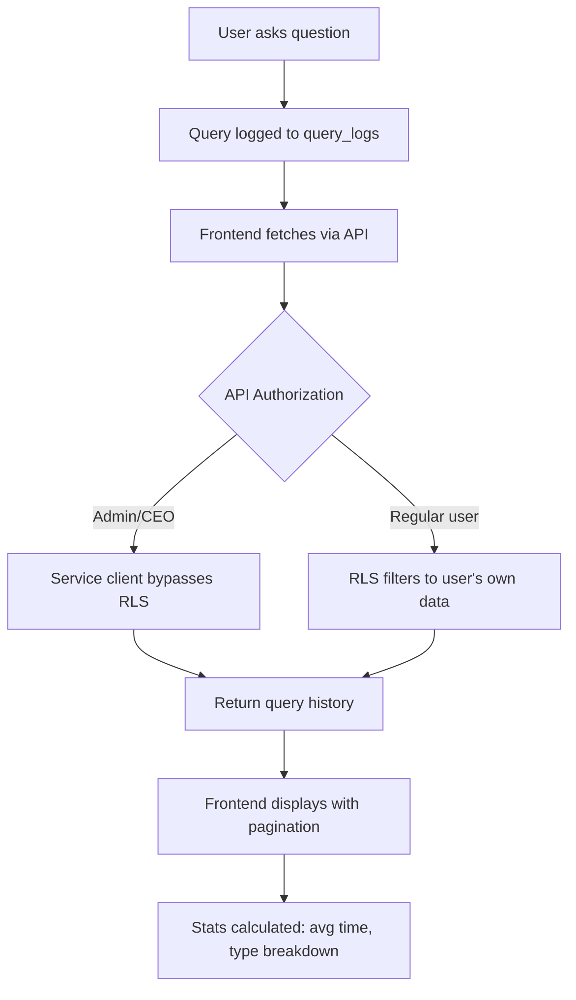

# Authentication Codes & Query History - Complete Analysis

**Database:** kuixphvkbuuzfezoeyii
**Date:** November 17, 2025
**Analysis Type:** Deep Architecture & Integration Review

---

## 📋 Executive Summary

The system uses a comprehensive authentication code and query tracking infrastructure built on Supabase. This analysis covers:
- ✅ Database schema for auth codes & query logs
- ✅ RLS policies & access control
- ✅ Existing API endpoints & patterns
- ✅ Frontend integration examples
- ✅ Implementation recommendations

---

## 🗄️ Database Schema Analysis

### 1. **verification_codes** - Authentication Code System

**Purpose:** Manage invitation/registration codes with advanced tracking and restrictions

**Key Fields:**
```typescript
{
  id: uuid                              // Primary key
  code: text (unique)                   // Format: "ZYW-TV2-DJV-LQC"
  tier: text                           // free | basic | pro | enterprise
  role: text                           // user | junior | senior | manager | admin | ceo
  status: text                         // active | used | expired | revoked

  // Usage Tracking
  max_uses: integer (default: 1)
  current_uses: integer (default: 0)
  used_by: text[]                      // Array of user IDs who used code
  used_at: timestamptz

  // Intended Recipient
  intended_recipient_id: uuid          // Link to user_credentials
  intended_recipient_name: text        // Display name (e.g., "KJ")
  intended_recipient_email: text
  intended_recipient_employee_id: text

  // Security & Restrictions
  requires_credential_match: boolean
  credential_match_fields: jsonb       // Fields that must match
  allowed_kakao_user_ids: text[]
  ip_restriction: text[]
  time_restriction: jsonb

  // Distribution
  distribution_method: text            // kakao | email | sms | manual
  distribution_status: text            // pending | sent | delivered | failed
  distributed_at: timestamptz

  // Metadata
  expires_at: timestamptz
  created_by: uuid
  created_by_name: text
  metadata: jsonb
  notes: text
}
```

**Sample Record** (Code: ZYW-TV2-DJV-LQC):
```json
{
  "code": "ZYW-TV2-DJV-LQC",
  "tier": "enterprise",
  "role": "user",
  "status": "used",
  "max_uses": 1,
  "current_uses": 1,
  "used_by": ["38327c27fb884d08e56f699efb9f75d41c21b38f544fe0029f4b38ab347bc44e08"],
  "used_at": "2025-11-17 08:41:44.208+00",
  "intended_recipient_name": "KJ",
  "intended_recipient_email": "asdf@asdf.com",
  "expires_at": "2025-12-17 08:16:19.747+00",
  "created_at": "2025-11-17 08:16:19.831386+00"
}
```

### 2. **query_logs** - User Query History

**Purpose:** Track all user questions and AI responses

**Key Fields:**
```typescript
{
  id: uuid                              // Primary key
  user_id: uuid                         // FK to profiles.id
  session_id: text                      // Group conversation turns
  kakao_user_id: text                   // For KakaoTalk users

  // Query Data
  query_text: text                      // User's question
  response_text: text                   // AI's answer
  query_type: text                      // rag | commission | general

  // Performance
  response_time_ms: integer             // Response latency

  // Metadata
  metadata: jsonb                       // Additional context
  timestamp: timestamptz (default: now())
}
```

**Query Types:**
- `rag` - Retrieval Augmented Generation (document-based)
- `commission` - Commission calculation queries
- `general` - General conversation

### 3. **chat_logs** - Conversation History

**Purpose:** Store complete chat conversations with message types

**Key Fields:**
```typescript
{
  id: uuid
  user_id: uuid                         // Profile ID (null for unauthenticated)
  kakao_user_id: text                   // KakaoTalk user ID
  session_id: text                      // Conversation grouping

  message_type: text                    // user | assistant | system
  message: text                         // Message content
  response: text                        // Response content
  query_type: text                      // rag | commission | general

  response_time_ms: integer
  metadata: jsonb
  created_at: timestamptz
  updated_at: timestamptz
}
```

### 4. **credential_verification_log** - Verification Audit Trail

**Purpose:** Log all code verification attempts and credential matching

**Key Fields:**
```typescript
{
  id: uuid
  verification_code: text
  kakao_user_id: text

  // Provided Information
  provided_email: text
  provided_employee_id: text
  provided_name: text
  provided_phone: text

  // Matching Results
  intended_credential_id: uuid
  match_status: text                    // matched | partial_match | no_match | no_credential_required
  match_score: float
  match_details: jsonb

  // Verification Outcome
  verification_result: text             // success | failed | rejected
  rejection_reason: text
  profile_created: uuid                 // FK to created profile

  // Security
  ip_address: inet
  user_agent: text
  timestamp: timestamptz
  metadata: jsonb
}
```

---

## 🔐 Row Level Security (RLS) Policies

### verification_codes
```sql
-- Authenticated users: Full access
Policy: verification_codes_authenticated_all
  Role: authenticated
  Command: ALL
  Check: true

-- Service role: Full access (API operations)
Policy: service_role_full_access_verification_codes
  Role: service_role
  Command: ALL
  Check: true
```

### query_logs
```sql
-- Authenticated users: Full access to own logs
Policy: query_logs_authenticated_all
  Role: authenticated
  Command: ALL
  Check: true

-- Service role: Full access
Policy: service_role_full_access_query_logs
  Role: service_role
  Command: ALL
  Check: true
```

### chat_logs
```sql
-- Authenticated users: Full access
Policy: chat_logs_authenticated_all
  Role: authenticated
  Command: ALL
  Check: true
```

### credential_verification_log
```sql
-- Admin/CEO only: Read access
Policy: Admin read access to verification log
  Role: authenticated
  Command: SELECT
  Check: EXISTS (
    SELECT 1 FROM profiles
    WHERE profiles.id = auth.uid()
    AND profiles.role IN ('admin', 'ceo')
  )
```

**🔒 Security Notes:**
- RLS ensures users can only access their own data
- Admin/CEO roles have elevated permissions for logs
- Service role bypasses RLS for API operations

---

## 🌐 API Endpoints

### Authentication Code APIs

#### 1. **GET /api/admin/codes** - List All Codes
```typescript
// Query Parameters
{
  page: number = 1
  limit: number = 20
  status: 'active' | 'used' | 'expired'
}

// Response
{
  codes: VerificationCode[]
  total: number
  page: number
  limit: number
  totalPages: number
}

// Authorization: Admin/CEO only
```

**Implementation:** `/app/api/admin/codes/route.ts`

#### 2. **POST /api/auth/verify-code** - Verify Access Code
```typescript
// Request
{
  code: string  // e.g., "ZYW-TV2-DJV-LQC"
}

// Response (Success)
{
  valid: true
  role: string
  tier: string
  metadata: object
  codeType: string
}

// Response (Error)
{
  error: string  // "유효하지 않은 인증 코드입니다" | "이미 사용된 인증 코드입니다" | "만료된 인증 코드입니다"
}

// Authorization: Public (no auth required)
```

**Code Normalization:**
- Converts to uppercase
- Removes spaces
- Standardizes to hyphen format

**Validation:**
1. ✅ Code exists
2. ✅ Not exceeded max_uses
3. ✅ Not expired (expires_at > now)

### Query History APIs

#### 3. **GET /api/admin/users/[id]/queries** - User Query History
```typescript
// Query Parameters
{
  page: number = 1
  limit: number = 50
}

// Response
{
  success: true
  data: {
    queries: QueryLog[]
    pagination: {
      page: number
      limit: number
      total: number
      totalPages: number
    }
    stats: {
      total_queries: number
      avg_response_time_ms: number
      query_type_breakdown: Record<string, number>
    }
  }
}

// Authorization: Admin/CEO only
// Uses service client to bypass RLS
```

**Implementation:** `/app/api/admin/users/[id]/queries/route.ts`

**Features:**
- ✅ Pagination support
- ✅ Performance stats (avg response time)
- ✅ Query type breakdown
- ✅ Ordered by timestamp DESC

#### 4. **GET /api/dashboard/recent-queries** - Recent Queries Dashboard
```typescript
// Query Parameters
{
  limit: number = 10
}

// Response
{
  queries: TransformedQuery[]
  total: number
}

// TransformedQuery
{
  id: string
  queryText: string
  responseTime: number
  queryType: string
  timestamp: string
  userId: string | null
  kakaoUserId: string | null
  userFullName: string
  userEmail: string
}

// Authorization: Authenticated users
```

**Implementation:** `/app/api/dashboard/recent-queries/route.ts`

**Features:**
- ✅ Left join with profiles (includes queries without user accounts)
- ✅ KakaoTalk user support
- ✅ User-friendly display names
- ✅ Recent-first ordering

#### 5. **GET /api/admin/logs** - Admin Query Logs
```typescript
// Query Parameters
{
  page: number = 1
  limit: number = 50
  type?: 'rag' | 'commission' | 'general'
  user_id?: string
}

// Response
{
  logs: QueryLog[]
  total: number
  page: number
  limit: number
  totalPages: number
}

// Authorization: Admin only
```

**Implementation:** `/app/api/admin/logs/route.ts`

**Features:**
- ✅ Filter by query type
- ✅ Filter by specific user
- ✅ Pagination
- ✅ Admin-only access

---

## 🎨 Frontend Integration Patterns

### Pattern 1: User Detail Page Query History

**File:** `/app/admin/users/[id]/page.tsx`

**Implementation:**
```typescript
// State Management
const [queryHistory, setQueryHistory] = useState<QueryHistoryData | null>(null)
const [queriesLoading, setQueriesLoading] = useState(false)
const [queryPage, setQueryPage] = useState(1)
const [expandedQuery, setExpandedQuery] = useState<string | null>(null)

// Fetch Function
const fetchQueryHistory = async () => {
  setQueriesLoading(true)
  const response = await fetch(
    `/api/admin/users/${userId}/queries?page=${queryPage}&limit=10`
  )
  const result = await response.json()
  setQueryHistory(result.data)
  setQueriesLoading(false)
}

// Auto-refresh on page change
useEffect(() => {
  if (userId) fetchQueryHistory()
}, [queryPage])
```

**Display Features:**
- ✅ Query type badges (RAG, Commission, General)
- ✅ Response time display
- ✅ Expandable Q&A view
- ✅ Stats summary (total queries, avg response time)
- ✅ Query type breakdown
- ✅ Pagination controls

**UI Components:**
```tsx
{/* Stats Header */}
<div className="text-sm text-gray-600">
  Total: {queryHistory.stats.total_queries} queries |
  Avg: {queryHistory.stats.avg_response_time_ms}ms
</div>

{/* Query Type Breakdown */}
{Object.entries(queryHistory.stats.query_type_breakdown).map(([type, count]) => (
  <span className="px-3 py-1 bg-blue-100 text-blue-800 rounded-full text-xs">
    {type}: {count}
  </span>
))}

{/* Individual Query Card */}
<div className="border rounded-lg p-4 hover:bg-gray-50">
  {/* Timestamp + Type Badge + Response Time */}
  <div className="flex items-center gap-2 mb-2">
    <span className="text-xs text-gray-500">
      {new Date(query.timestamp).toLocaleString()}
    </span>
    <span className={`px-2 py-0.5 rounded text-xs ${badgeColor}`}>
      {query.query_type}
    </span>
    <span className="text-xs text-gray-500">{query.response_time_ms}ms</span>
  </div>

  {/* Question */}
  <div className="text-sm bg-blue-50 p-3 rounded">
    {expandedQuery === query.id ? query.query_text : truncateText(query.query_text, 150)}
  </div>

  {/* Answer */}
  <div className="text-sm bg-green-50 p-3 rounded whitespace-pre-wrap">
    {expandedQuery === query.id ? query.response_text : truncateText(query.response_text, 200)}
  </div>

  {/* Expand/Collapse Button */}
  <button onClick={() => setExpandedQuery(...)}>
    {expandedQuery === query.id ? 'Show less' : 'Show more'}
  </button>
</div>

{/* Pagination */}
<div className="flex items-center justify-between pt-4 border-t">
  <button onClick={() => setQueryPage(p => Math.max(1, p - 1))}>
    Previous
  </button>
  <span>Page {pagination.page} of {pagination.totalPages}</span>
  <button onClick={() => setQueryPage(p => Math.min(totalPages, p + 1))}>
    Next
  </button>
</div>
```

### Pattern 2: Admin Logs Page

**File:** `/app/admin/logs/page.tsx`

**Structure:**
```tsx
<DashboardLayout>
  <div className="space-y-6">
    {/* Page Header */}
    <div>
      <h1>쿼리 로그</h1>
      <p>모든 챗봇 쿼리 기록을 확인하고 분석합니다</p>
    </div>

    {/* Filters */}
    <LogsFilters />

    {/* Logs Table */}
    <LogsTable />
  </div>
</DashboardLayout>
```

**Components Used:**
- `LogsFilters` - Filter by type, user, date range
- `LogsTable` - Display all query logs with pagination

### Pattern 3: Codes Management Page

**File:** `/app/admin/codes/page.tsx`

**Structure:**
```tsx
<DashboardLayout>
  <div className="space-y-6">
    {/* Header with Actions */}
    <div className="flex items-center justify-between">
      <div>
        <h1>인증 코드 관리</h1>
        <p>액세스 코드를 생성하고 관리합니다</p>
      </div>
      <Link href="/admin/codes/generate">
        <Plus /> 코드 생성
      </Link>
    </div>

    {/* Codes Table */}
    <CodesTable />
  </div>
</DashboardLayout>
```

---

## 🔍 Query History Data Flow



---

## 📊 Example Frontend Call Patterns

### 1. Fetch User's Query History (Admin View)

```typescript
// Component state
const [queryHistory, setQueryHistory] = useState<QueryHistoryData | null>(null)
const [page, setPage] = useState(1)

// Fetch function
async function fetchQueries(userId: string, page: number) {
  const response = await fetch(
    `/api/admin/users/${userId}/queries?page=${page}&limit=10`
  )
  const data = await response.json()

  if (data.success) {
    setQueryHistory(data.data)
    console.log('Total queries:', data.data.stats.total_queries)
    console.log('Avg response time:', data.data.stats.avg_response_time_ms, 'ms')
  }
}

// Usage
useEffect(() => {
  fetchQueries(userId, page)
}, [userId, page])
```

### 2. Display Query with Expand/Collapse

```typescript
// State for expanded items
const [expandedQuery, setExpandedQuery] = useState<string | null>(null)

// Truncate helper
function truncateText(text: string, maxLength: number) {
  if (text.length <= maxLength) return text
  return text.substring(0, maxLength) + '...'
}

// Render
{queryHistory.queries.map(query => (
  <div key={query.id}>
    {/* Question */}
    <div className="bg-blue-50 p-3 rounded">
      {expandedQuery === query.id
        ? query.query_text
        : truncateText(query.query_text, 150)}
    </div>

    {/* Answer */}
    <div className="bg-green-50 p-3 rounded">
      {expandedQuery === query.id
        ? query.response_text
        : truncateText(query.response_text, 200)}
    </div>

    {/* Toggle button */}
    {(query.query_text.length > 150 || query.response_text.length > 200) && (
      <button onClick={() => setExpandedQuery(
        expandedQuery === query.id ? null : query.id
      )}>
        {expandedQuery === query.id ? 'Show less' : 'Show more'}
      </button>
    )}
  </div>
))}
```

### 3. Query Type Badge Styling

```typescript
function getQueryTypeBadge(type: string) {
  const styles = {
    rag: 'bg-purple-100 text-purple-800',
    commission: 'bg-green-100 text-green-800',
    general: 'bg-gray-100 text-gray-800'
  }
  return styles[type] || styles.general
}

// Usage
<span className={`px-2 py-0.5 rounded text-xs ${getQueryTypeBadge(query.query_type)}`}>
  {query.query_type}
</span>
```

### 4. Pagination Component

```typescript
<div className="flex items-center justify-between pt-4 border-t">
  <button
    onClick={() => setPage(p => Math.max(1, p - 1))}
    disabled={page === 1}
    className="px-4 py-2 border rounded-lg disabled:opacity-50"
  >
    Previous
  </button>

  <span className="text-sm text-gray-600">
    Page {pagination.page} of {pagination.totalPages}
  </span>

  <button
    onClick={() => setPage(p => Math.min(pagination.totalPages, p + 1))}
    disabled={page === pagination.totalPages}
    className="px-4 py-2 border rounded-lg disabled:opacity-50"
  >
    Next
  </button>
</div>
```

---

## 💡 Implementation Recommendations

### For Authentication Codes

#### 1. **Code Verification Flow**
```typescript
// Client-side verification
async function verifyAccessCode(code: string) {
  try {
    const response = await fetch('/api/auth/verify-code', {
      method: 'POST',
      headers: { 'Content-Type': 'application/json' },
      body: JSON.stringify({ code })
    })

    const data = await response.json()

    if (!response.ok) {
      // Handle errors: invalid, used, expired
      alert(data.error)
      return null
    }

    // Success: code is valid
    return {
      role: data.role,
      tier: data.tier,
      metadata: data.metadata
    }
  } catch (error) {
    console.error('Code verification failed:', error)
    return null
  }
}
```

#### 2. **Code Display Best Practices**
```typescript
// Format for display
function formatCode(code: string) {
  return code.match(/.{1,3}/g)?.join('-') || code
}

// Example: "ZYWFV2DJVLQC" → "ZYW-TV2-DJV-LQC"
```

#### 3. **Code Status Badge**
```typescript
function getCodeStatusBadge(code: VerificationCode) {
  const now = new Date()
  const expires = new Date(code.expires_at)

  if (code.status === 'used' && code.current_uses >= code.max_uses) {
    return { text: 'USED', color: 'bg-green-100 text-green-800' }
  }
  if (now > expires || code.status === 'expired') {
    return { text: 'EXPIRED', color: 'bg-red-100 text-red-800' }
  }
  if (code.status === 'revoked') {
    return { text: 'REVOKED', color: 'bg-gray-100 text-gray-800' }
  }
  return { text: 'ACTIVE', color: 'bg-blue-100 text-blue-800' }
}
```

### For Query History

#### 1. **Real-time Stats Calculation**
```typescript
// Calculate stats from query array
function calculateQueryStats(queries: QueryLog[]) {
  const totalQueries = queries.length
  const avgResponseTime = queries.length > 0
    ? Math.round(
        queries.reduce((sum, q) => sum + (q.response_time_ms || 0), 0) / queries.length
      )
    : 0

  const typeBreakdown = queries.reduce((acc, q) => {
    acc[q.query_type] = (acc[q.query_type] || 0) + 1
    return acc
  }, {} as Record<string, number>)

  return { totalQueries, avgResponseTime, typeBreakdown }
}
```

#### 2. **Export Query History**
```typescript
// Export to CSV
function exportQueryHistory(queries: QueryLog[], filename: string) {
  const csv = [
    ['Timestamp', 'Question', 'Answer', 'Type', 'Response Time (ms)'],
    ...queries.map(q => [
      new Date(q.timestamp).toLocaleString(),
      q.query_text.replace(/"/g, '""'),
      q.response_text.replace(/"/g, '""'),
      q.query_type,
      q.response_time_ms.toString()
    ])
  ]
    .map(row => row.map(cell => `"${cell}"`).join(','))
    .join('\n')

  const blob = new Blob([csv], { type: 'text/csv' })
  const url = URL.createObjectURL(blob)
  const a = document.createElement('a')
  a.href = url
  a.download = filename
  a.click()
  URL.revokeObjectURL(url)
}
```

#### 3. **Search & Filter Queries**
```typescript
// Client-side filtering
function filterQueries(
  queries: QueryLog[],
  filters: {
    searchTerm?: string
    queryType?: string
    dateFrom?: Date
    dateTo?: Date
  }
) {
  return queries.filter(q => {
    // Search in question and answer
    if (filters.searchTerm) {
      const term = filters.searchTerm.toLowerCase()
      const inQuestion = q.query_text.toLowerCase().includes(term)
      const inAnswer = q.response_text.toLowerCase().includes(term)
      if (!inQuestion && !inAnswer) return false
    }

    // Filter by type
    if (filters.queryType && q.query_type !== filters.queryType) {
      return false
    }

    // Filter by date range
    const timestamp = new Date(q.timestamp)
    if (filters.dateFrom && timestamp < filters.dateFrom) return false
    if (filters.dateTo && timestamp > filters.dateTo) return false

    return true
  })
}
```

#### 4. **Performance Monitoring**
```typescript
// Track slow queries
function identifySlowQueries(queries: QueryLog[], threshold: number = 1000) {
  return queries.filter(q => q.response_time_ms > threshold)
}

// Performance summary
function getPerformanceSummary(queries: QueryLog[]) {
  const responseTimes = queries.map(q => q.response_time_ms)

  return {
    min: Math.min(...responseTimes),
    max: Math.max(...responseTimes),
    avg: Math.round(responseTimes.reduce((a, b) => a + b, 0) / responseTimes.length),
    median: responseTimes.sort((a, b) => a - b)[Math.floor(responseTimes.length / 2)],
    p95: responseTimes.sort((a, b) => a - b)[Math.floor(responseTimes.length * 0.95)]
  }
}
```

---

## 🎯 Quick Reference

### Database Tables
| Table | Purpose | Key Columns |
|-------|---------|-------------|
| `verification_codes` | Auth codes | code, tier, role, status, used_by |
| `query_logs` | Query history | query_text, response_text, query_type, response_time_ms |
| `chat_logs` | Chat conversations | message, response, message_type, session_id |
| `credential_verification_log` | Verification audit | verification_code, match_status, verification_result |

### API Endpoints
| Endpoint | Method | Auth | Purpose |
|----------|--------|------|---------|
| `/api/admin/codes` | GET | Admin | List all codes |
| `/api/auth/verify-code` | POST | Public | Verify access code |
| `/api/admin/users/[id]/queries` | GET | Admin | User query history |
| `/api/dashboard/recent-queries` | GET | Auth | Recent queries |
| `/api/admin/logs` | GET | Admin | All query logs |

### Key Frontend Components
- `CodesTable` - Display and manage codes
- `LogsTable` - Display query logs
- `LogsFilters` - Filter logs by type/user/date
- User detail page - Shows query history per user

### Common Patterns
- ✅ Pagination with `page` & `limit` params
- ✅ Service client for admin bypassing RLS
- ✅ Expandable Q&A with truncation
- ✅ Query type badges with color coding
- ✅ Performance stats (avg response time)

---

## 🔗 Related Files

**API Routes:**
- `/app/api/admin/codes/route.ts`
- `/app/api/auth/verify-code/route.ts`
- `/app/api/admin/users/[id]/queries/route.ts`
- `/app/api/dashboard/recent-queries/route.ts`
- `/app/api/admin/logs/route.ts`

**Pages:**
- `/app/admin/codes/page.tsx`
- `/app/admin/users/[id]/page.tsx`
- `/app/admin/logs/page.tsx`

**Database:**
- Database: `kuixphvkbuuzfezoeyii`
- Tables: `verification_codes`, `query_logs`, `chat_logs`, `credential_verification_log`
